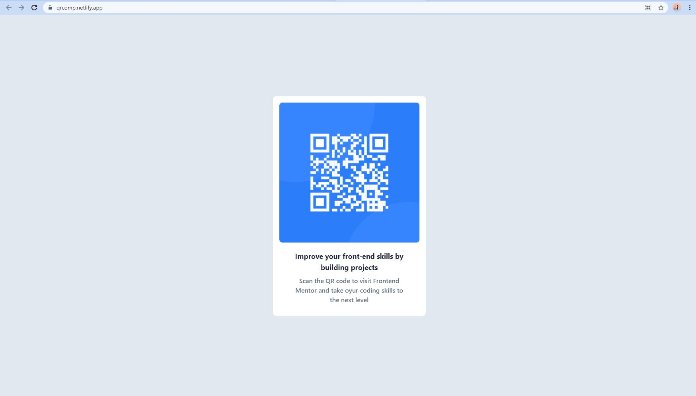

# Frontend Mentor - QR code component solution

This is a solution to the [QR code component challenge on Frontend Mentor](https://www.frontendmentor.io/solutions/frontend-mentor-qr-code-component-solution-EapORO21QJ). Frontend Mentor challenges help you improve your coding skills by building realistic projects. 

## Table of contents

- [Overview](#overview)
  - [Screenshot](#screenshot)
  - [Links](#links)
- [My process](#my-process)
  - [Built with](#built-with)
- [Author](#author)

## Overview

### Screenshot

### Links

- Solution URL: [Add solution URL here](https://www.frontendmentor.io/solutions/frontend-mentor-qr-code-component-solution-EapORO21QJ)
- Live Site URL: [Add live site URL here](https://qrcomp.netlify.app/)

## My process

### Built with

- Semantic HTML5 markup
- [Tailwind CSS](https://tailwindcss.com/) - For CSS

## Author

- Frontend Mentor - [@darshan-hulswar](https://www.frontendmentor.io/profile/darshan-hulswar)
- Twitter - [@darshanhulswar](https://www.twitter.com/darshanhulswar)
